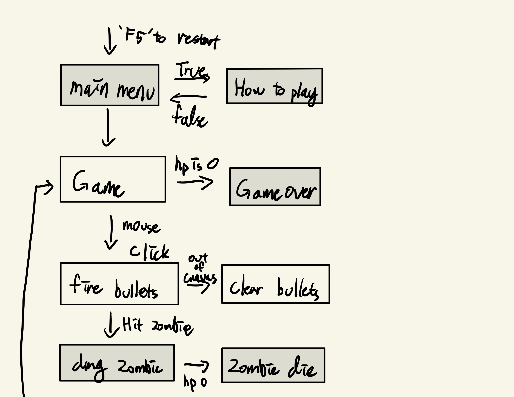
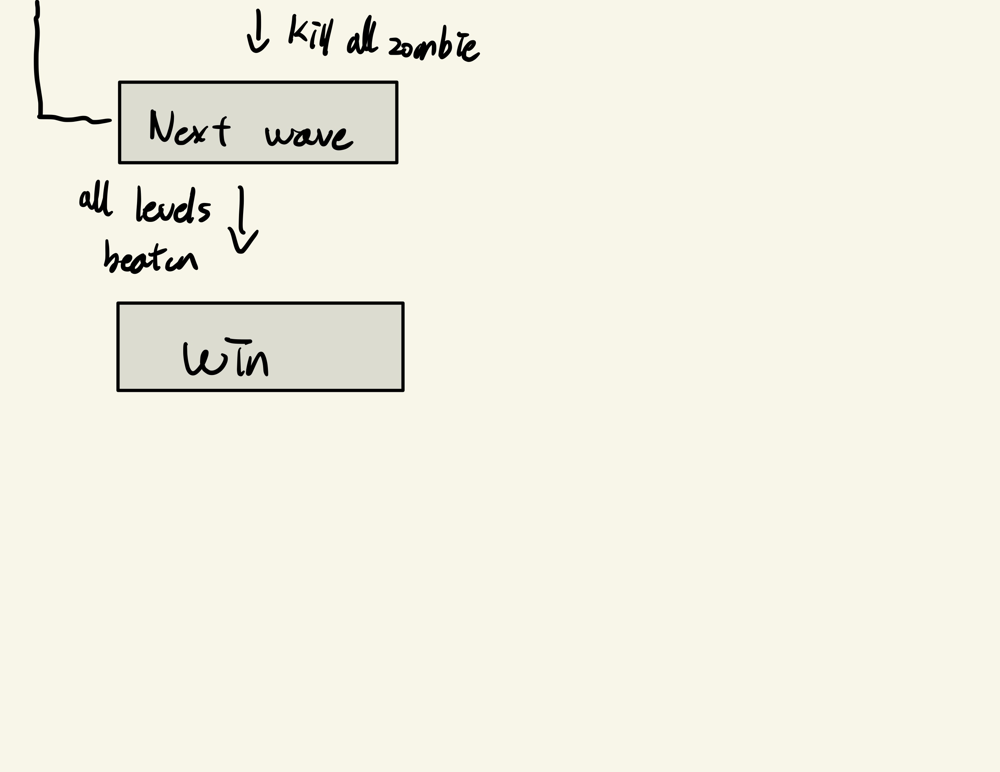

## Game Design Document

Create a **`GameDesign.md`** file.

### High Concept

As clearly and simply as you can, explain your game idea.

### Theme

Your game must adhere to the following theme: **Take One, Leave The Rest**

    - The theme/setting/scenario/mechanic of your game must be something that involves this theme.

Explain how your game idea works with the theme.

### Mock Ups

Create a visual flow of the User Experience (How will people interact with the program and what will they see when doing so?)

Visually draw out things like Main Menu, Credits, Options, Play etc...

Provide a rough drawing of what the play scene(s) look like. How is it organized? What is the User Interface? How do players interact with the game?

We are looking for rough sketches, flow charts and concept images.

## Theme 
Last Survivor

## Setting
The world had been bioharzard by zombie strike. and player is the one last survivor

## scenario
Player is attacked by zombie. He has to kill them to protect himself. No one can help. Only He can protect himself.

## mechanic
Player aims at mouse point way. player can shoot the gun by clicking the mouse. He can upgrade the gun and buy the heal-pack from a machine.

### Mock Ups

</img> 

</img> 